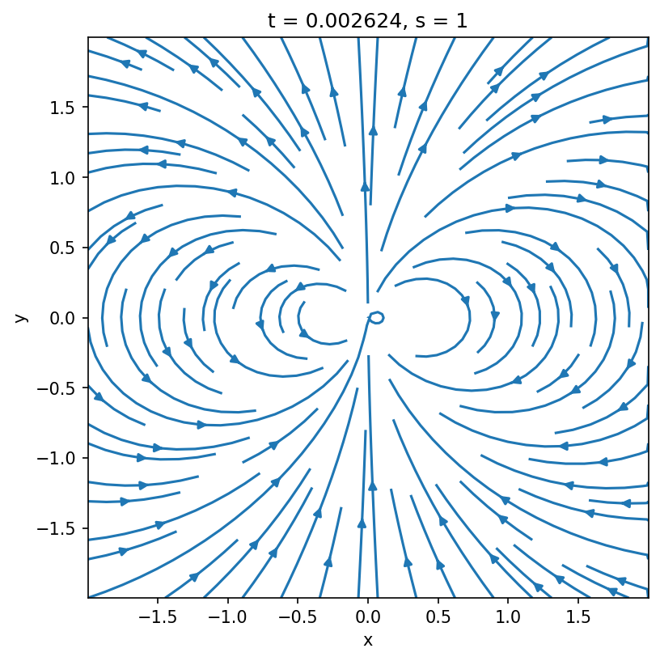
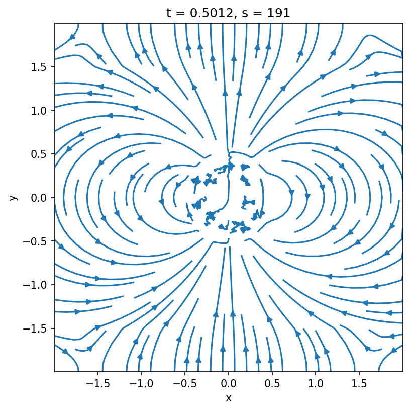
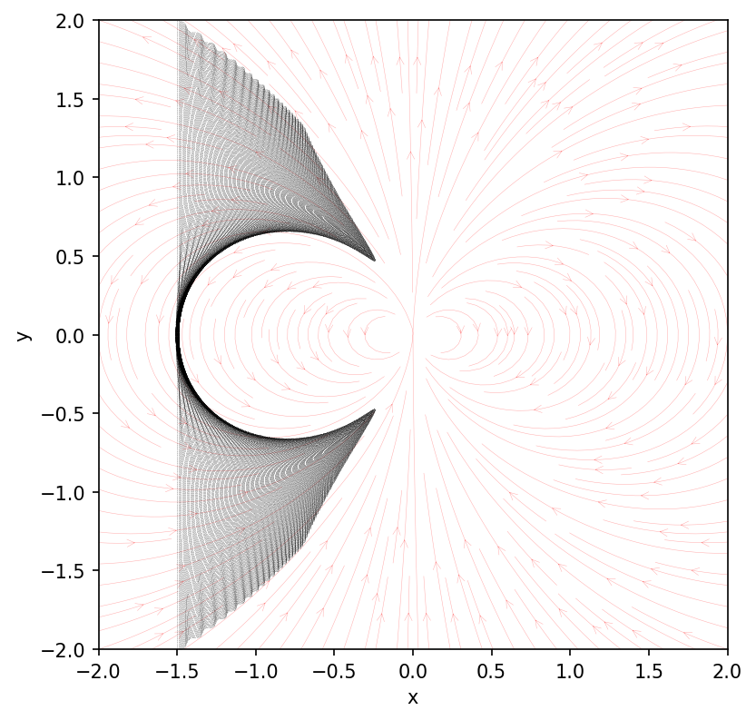
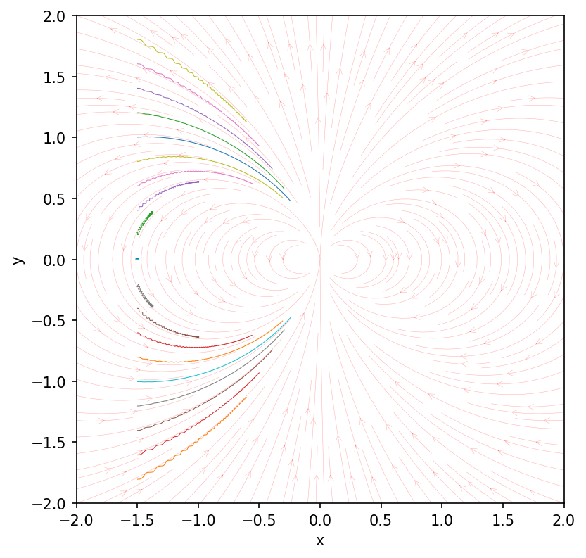

---
hide:
  - footer
---

# Designing your first problem generator

Problem generators are the user entry points of `Entity`, and they allow to customize the simulation to your own liking by specifying custom initialization as well as other routines to alter the flow of the simulation. In this tutorial, we discuss how you can write your own custom problem generator, gradually increasing its complexity. In the interest of brevity, we will skip some of the detailed explanations; if you want to dive more into why and how things work -- please refer to the more detailed discussion on all the capabilities of [problem generators](../2-howto/1-problem_generators.md).

In all the cases described below, you will first need to create a file called `pgen.hpp` and place it anywhere in your filesystem:

```sh
mkdir -p <SOME_PATH>/MyFirstPgen
touch <SOME_PATH>/MyFirstPgen/pgen.hpp
```

## Cartesian `SRPIC`

Open the `pgen.hpp` you created and define the following class template inside of it:

```cpp
#ifndef PROBLEM_GENERATOR_H
#define PROBLEM_GENERATOR_H

#include "enums.h"
#include "global.h"

#include "archetypes/traits.h"
#include "archetypes/problem_generator.h"
#include "framework/domain/metadomain.h"
#include "framework/parameters/parameters.h"

namespace user {
  using namespace ntt;

  template <SimEngine::type S, class M>
  struct PGen : public arch::ProblemGenerator<S, M> {
    static constexpr auto engines {
      arch::traits::pgen::compatible_with<SimEngine::SRPIC>::value
    };
    static constexpr auto metrics {
      arch::traits::pgen::compatible_with<Metric::Minkowski>::value
    };
    static constexpr auto dimensions {
      arch::traits::pgen::compatible_with<Dim::_2D, Dim::_3D>::value
    };
    inline PGen(const SimulationParams& p, const Metadomain<S, M>&)
      : arch::ProblemGenerator<S, M> { p } {}
  };

} // namespace user

#endif // PROBLEM_GENERATOR_H
```

This defines an empty structure, with traits specifying that its compatible with 2D, and 3D Cartesian special-relativistic engine. Currently, this problem generator does nothing. It will initialize an empty simulation domain with no preset electromagnetic fields. 

### Adding a dipole magnetic field

Let's fix that by adding a dipolar magnetic field centered at the origin of our domain. This is done by defining a class (outside our problem generator) which will provide coordinate-dependent analytic formulas for our magnetic fields:

```cpp hl_lines="3-16"
namespace user {

  template <Dimension D>
  struct DipoleField {
    Inline auto bx1(const coord_t<D>& x) const -> real_t {
      // ...
    }

    Inline auto bx2(const coord_t<D>& x) const -> real_t {
      // ...
    }

    Inline auto bx3(const coord_t<D>& x) const -> real_t {
      // ...
    }
  };
  
  
  template <SimEngine::type S, class M>
  struct PGen : public arch::ProblemGenerator<S, M> {
    // ...
  };

} // namespace user
```

First, note that this is a class template (indicated by `template <Dimension D>`), meaning that the parameter `D` will be determined at compile time, and based on its value the size of the coordinate vector passed to the `bx1`, `bx2`, `bx3` functions will either be 2D or 3D. This kind of templating allows us to modify the behavior of the class at compile time based on the value of `D` without having to define two separate classes. `bx1`, `bx2`, `bx3` class methods are essentially functions that take in a physical coordinate within the domain and return the corresponding B-field component value at that position. 

!!! note "Don't forget the `Inline`"

    Note, that these methods are indicated to be `Inline`, which is an alias of `KOKKOS_INLINE_FUNCTION`, and which indicates that this function can be run on both CPUs and GPUs. This is essential for our purposes, and this clause should be used with any functions that are intended to be called from a GPU.

We will assume that the center of the dipole is at point $(0, 0)$ (or $(0, 0, 0)$ in 3D), and that the magnetic moment is pointed along the $\hat{\bm{y}}$ axis. The formula for the dipole we will be using will look something like the following:

$$
\bm{B}= B_0\frac{3\hat{\bm{n}}(\hat{\bm{\mu}}\cdot{\hat{\bm{n}}}) - {\hat{\bm{\mu}}}}{r^3}
$$

where $\hat{\bm{\mu}} = \hat{\bm{y}}$, and $\hat{\bm{n}} = \bm{r}/r$. The value of $B_0$ thus defines the magnetic field strength at a nominal distance from the origin of $r=1$. We will define the fields in units of this fiducial field $B_0$. Let's define the `DipoleField` class:

```cpp
template <Dimension D>
struct DipoleField {
  Inline auto radius(const coord_t<D>&) const -> real_t;

  Inline auto bx1(const coord_t<D>& x) const -> real_t {
    return THREE * x[0] * x[1] / math::pow(radius(x), 5);
  }

  Inline auto bx2(const coord_t<D>& x) const -> real_t {
    const auto r = radius(x);
    return (THREE * x[1] * x[1] - SQR(r)) / math::pow(r, 5);
  }

  Inline auto bx3(const coord_t<D>& x) const -> real_t {
    if constexpr (D == Dim::_3D) {
      return THREE * x[2] * x[1] / math::pow(radius(x), 5);
    } else {
      return ZERO;
    }
  }
};

template <>
Inline auto DipoleField<Dim::_2D>::radius(const coord_t<Dim::_2D>& x) const
  -> real_t {
  return math::sqrt(SQR(x[0]) + SQR(x[1]));
}

template <>
Inline auto DipoleField<Dim::_3D>::radius(const coord_t<Dim::_3D>& x) const
  -> real_t {
  return math::sqrt(SQR(x[0]) + SQR(x[1]) + SQR(x[2]));
}
```

This demonstrates two commonly used patterns. We introduce a new method `radius()` inside the class (we can use any name we want for it) which returns the distance from the origin. Because in 2D and 3D the computation looks slightly different, we specialize this method in two different ways (this is where the power of templates comes in handy). Second, in the definition of `bx3`, we use a compile-time `if`-statement -- `if constexpr` -- which checks the dimensionality, and returns the value of `bx3` depending on that (in 2D, there is no out-of-plane magnetic field if the plane contains the origin of the dipole). We could have done the same exact thing with the `radius` method of course.

Now that we have our class, we can tell the problem generator to initialize the fields using this class, by defining a specially named instance called `init_flds` inside the `PGen` class:

```cpp hl_lines="6"
template <SimEngine::type S, class M>
struct PGen : public arch::ProblemGenerator<S, M> {

  // ...

  DipoleField<M::Dim> init_flds;

  inline PGen(const SimulationParams& p, const Metadomain<S, M>&)
    : arch::ProblemGenerator<S, M> { p } {}
};
```

Notice, that we are passing the dimensionality `D` template argument from the metric to the `DipoleField` class template to initialize a specific *version* of this class (which should correspond to our metric dimension).

Let's now run this and see what we get. For that, we will need an input file which defines the parameters of the simulation. Let's use a very simple one which specifies periodic boundary conditions for both fields and particles. If you want to dig deeper into what options are available in the input file, you can refer to [this guide](../1-getting-started/3-inputfile.md).

```toml
[simulation]
  name    = "my_first_pgen"
  engine  = "srpic"
  runtime = 1.0

[grid]
  resolution = [1024, 1024]
  extent     = [[-2.0, 2.0], [-2.0, 2.0]]

  [grid.metric]
    metric = "minkowski"

  [grid.boundaries]
    fields    = [["PERIODIC"], ["PERIODIC"]]
    particles = [["PERIODIC"], ["PERIODIC"]]

[scales]
  larmor0    = 0.003
  skindepth0 = 0.01

[particles]
  ppc0 = 8.0

[output]
  interval_time = 0.1

  [output.fields]
    quantities = ["E", "B"]

  [output.particles]
    enable = false

  [output.spectra]
    enable = false

[checkpoint]
  keep = 0
```

For now, ignore the `larmor0`, `skindepth0` and `ppc0` parameters, we're just using some placeholder values. Importantly, we are defining the domain to extend from $-2$ to $2$ in both $x$ and $y$ with $1024$ cells in each dimension, and with periodic boundary conditions. We are also specifying that we want to output fields every $0.1$ time intervals (if $4$ is the extent of the box, than the light-crossing time of the box is also $4$, since $c\equiv 1$, and we output essentially $40$ times per each light-crossing).

If you now run the simulation and plot the result, you should see a beautiful dipolar field at time $t=0$ (to see more details on how to do the plotting, please refer to the [`nt2py` manual](../2-howto/2-vis.md#nt2py)).

??? showplot "plot of B-field at $t=0$"

    ```python
    data = nt2.Data("my_first_pgen")
    plt.figure(figsize=(6, 6), dpi=150)
    data.fields.sel(t=0, method="nearest").plot.streamplot(x="x", y="y", u="Bx", v="By")
    plt.gca().set_aspect(1)
    ```

    {width=80% class="invertlight"} 

If you try plotting the same at a later time, you might see things getting wild.

??? showplot "plot of B-field at $t=0.5$"

    ```python
    data = nt2.Data("my_first_pgen")
    plt.figure(figsize=(6, 6), dpi=150)
    data.fields.sel(t=0.5, method="nearest").plot.streamplot(x="x", y="y", u="Bx", v="By")
    plt.gca().set_aspect(1)
    ```

    {width=80% class="invertlight"} 

There are two issues that cause this behavior. 

First, note that there is a $1/r^3$ in our expressions for the $B$-field; so close to the origin, the value of the field becomes too large and, ultimately, undefined. Because of this, $\nabla\times\bm{B}$ is ill-defined near the origin, and Maxwell-solver generates large electric field which then propagates outward and destroys our equilibrium (this is what these blobby fieldlines in the middle are).

Second, because we specified the boundary conditions for fields as being periodic, the same $\nabla\times\bm{B}$ is non-zero near the boundary, which, again, gives rise to a displacement current and is, thus, a non-equilibrium.

### Making fields "external"

In the case when the initial fields are curl-free, $\nabla\times\bm{B}_d = 0$ (where $\bm{B}_d$ is our dipolar field), there is actually a fairly simple solution to both of these issues above. Notice, that the Maxwell's equations can be rewritten as:

$$
\begin{aligned}
\frac{\partial \bm{E}}{c\partial t} &= \nabla\times\left(\bm{B} + \bm{B}_d\right) - \frac{4\pi}{c}\bm{j} = \nabla\times\bm{B} - \frac{4\pi}{c}\bm{j}, \\\\
\frac{\partial \left(\bm{B}+\bm{B}_d\right)}{c\partial t} = \frac{\partial \bm{B}}{c\partial t} &= -\nabla\times\bm{E},
\end{aligned}
$$

where we can essentially get rid of $\bm{B}_d$ from inside the $\nabla\times$ and $\partial/\partial t$ as the dipole field is both curl-free and time-independent. This means, that as far as Maxwell's equations are concerned, the dipole field doesn't even exist, which means that only our charges need to be able to "feel" it, but the evolution of fields is not affected by its presence.

In `Entity`, this can be done by defining the so-called "external" fields -- fields which are only experienced by the particles (in addition to the fields on the grid), but which do not enter Maxwell's equations. To use the external fields, simply comment out the `init_flds` declaration in the problem generator and define the following method:

```cpp hl_lines="6 8-11"
template <SimEngine::type S, class M>
struct PGen : public arch::ProblemGenerator<S, M> {

  // ...

  // DipoleField<M::Dim> init_flds;

  inline auto ExternalFields(simtime_t, spidx_t, const Domain<S, M>&) const
    -> std::pair<bool, DipoleField<M::Dim>> {
    return { true, DipoleField<M::Dim> {} };
  }

  inline PGen(const SimulationParams& p, const Metadomain<S, M>&)
    : arch::ProblemGenerator<S, M> { p } {}
};
```

This method takes in the simulation time, the index of the species currently being processed and the reference to the local subdomain, and returns two things. First, it returns a boolean expression to indicate whether the external fields need to be applied or not. You may choose to selectively apply the field to specific particle species, at specific times, or following any custom logic. The second argument is the field structure itself. Once the code sees that this `ExternalFields` method is defined, it will add these fields to the ones "felt" by the particles (if the first argument is true), but will not use them in the Maxwell-solver.

If you compile and run this, you should not see anything at all. The external fields are not output with the fields on the grid, so all your fields will simply be zero, and there will be no dynamics since there are no particles in our simulation.

### Adding test particles

To test the effect of our external fields, let's add test particles to our simulations. There are different ways of doing this, but we will focus on the most straightforward one for now, which is using the `arch::InjectGlobally` function, which takes in particle coordinates and velocities and manually puts them on the grid. Here is how it is going to look like:

```cpp hl_lines="1 8 12 14-24"
#include "archetypes/particle_injector.h" // <-- add this header file

template <SimEngine::type S, class M>
struct PGen : public arch::ProblemGenerator<S, M> {

  // ...

  const Metadomain<S, M>& metadomain;
  
  inline PGen(const SimulationParams& p, const Metadomain<S, M>& metadomain)
    : arch::ProblemGenerator<S, M> { p }
    , metadomain { metadomain } {}

  inline void InitPrtls(Domain<S, M>& domain) {
    std::map<std::string, std::vector<real_t>> particles {
      {  "x1", {} },
      {  "x2", {} },
      {  "x3", {} },
      { "ux1", {} },
      { "ux2", {} },
      { "ux3", {} }
    };
    arch::InjectGlobally<S, M>(metadomain, domain, 1u, particles);
  }
};
```

Notice, that we now need to capture the `metadomain` object from the problem generator's constructor and save the reference to it to pass it later to the injector. The actual injector itself is called within the special `InitPrtls` method which only accepts the `Domain` object as an input. We pass the `metadomain`, the local `domain`, the index of the species to be injected (`1u` in this case for the first species), and the actual data for the coordinates/velocities -- `particles`. The latter is a simple `std::map<std::string, std::vector<real_t>>` (a-la Python dictionary of arrays), where the keys are `x1`, `x2`, `x3`, `ux1`, `ux2`, `ux3` and the values are arrays of real numbers (`std::vector<real_t>`) for each of the coordinate/velocity components.

We may populate this container however we want, but for now, let's simply initialize a fixed number of particles along the $x=-1.5$ (and $z=0$ in 3D) line, with particles moving in the $+\hat{\bm{x}}$ direction with a velocity of $\gamma\beta = |\bm{u}| = 1$. Add the following to the `InitPrtls` method:

```cpp
const auto npart = 1000u;
const auto ymin  = metadomain.mesh().extent(in::x2).first;
const auto ymax  = metadomain.mesh().extent(in::x2).second;
const auto dy    = (ymax - ymin) / static_cast<real_t>(npart - 1u);
for (auto p { 0u }; p < npart; ++p) {
  particles["x1"].push_back(-1.5);
  particles["x2"].push_back(ymin + p * dy);
  particles["x3"].push_back(0.0);
  particles["ux1"].push_back(1.0);
  particles["ux2"].push_back(0.0);
  particles["ux3"].push_back(0.0);
}
```

Here, we are reading the extent of the global domain from the `metadomain.mesh()` object, splitting it into `npart - 1` equal parts and defining the positions of particles displaced by `dy` in $\hat{\bm{y}}$ direction.

Finally, let's do a few modifications to our input file:

```toml hl_lines="21-22 27-31 37 39-41"
[simulation]
  name    = "my_first_pgen"
  engine  = "srpic"
  runtime = 1.0

[grid]
  resolution = [1024, 1024]
  extent     = [[-2.0, 2.0], [-2.0, 2.0]]

  [grid.metric]
    metric = "minkowski"

  [grid.boundaries]
    fields    = [["PERIODIC"], ["PERIODIC"]]
    particles = [["PERIODIC"], ["PERIODIC"]]

[scales]
  larmor0    = 0.003
  skindepth0 = 0.01

[algorithms.deposit]
  enable = false

[particles]
  ppc0 = 8.0

  [[particles.species]]
    label    = "e+"
    charge   = 1.0
    mass     = 1.0
    maxnpart = 1e5
    tracking = true

[output]
  interval_time = 0.1

  [output.fields]
    quantities = ["N_1", "E", "B"]

  [output.particles]
    interval_time = 0.01
    stride        = 1

  [output.spectra]
    enable = false

[checkpoint]
  keep = 0
```

We defined a particle species with mass $m=m_0$, $q=q_0$ and we also made sure to output these particles more frequently than the fields, with `stride = 1` meaning that every particle will be written into the output. Note, that we also disabled the current deposition for now, and added the number density of this species to be output as a field quantity.

!!! note "Also disable the fieldsolver"

    At this stage, we don't really need the fieldsolver, so feel free to disable it for now to speed up the calculation (refer to the [input file guide](../1-getting-started/3-inputfile.md) for how to do that).

In the plot below we see the trajectories of all the particles, overplot with the magnetic fieldlines (we cannot plot from the output fields directly, as they do not include the external fields).

??? showplot "all particles"

    ```python
    def plot_dipole():
        xs = np.linspace(-2, 2, 150)
        ys = np.linspace(-2, 2, 150)
        xx, yy = np.meshgrid(xs, ys)
        rr = np.sqrt(xx**2 + yy**2)
        bx = 3 * xx * yy / rr**5
        by = (3 * yy**2 - rr**2) / rr**5

        plt.streamplot(
            xx,
            yy,
            bx,
            by,
            color="#ff000050",
            linewidth=0.25,
            zorder=-10,
            arrowstyle="->",
            density=2,
        )


    plt.figure(figsize=(6, 6), dpi=150)
    data.particles.load().plot.scatter(x="x", y="y", c="k", lw=0, s=0.02, ax=plt.gca())
    plt.gca().set_aspect(1)

    plot_dipole()

    plt.xlim(-2, 2)
    plt.ylim(-2, 2)
    ```

    {width=80% class="invertlight"} 

The pattern that emerges from the combination of particle trajectories might seem a bit off at first glance -- it does not follow the field lines directly. As a simple test, we can try and follow the trajectories of individual particle. Rerun the simulation enabling the particle tracking from the input file:

```toml hl_lines="6"
  [[particles.species]]
    label    = "e+"
    charge   = 1.0
    mass     = 1.0
    maxnpart = 1e5
    tracking = true
```

From the plot below we clearly see that particles do in fact travel along magnetic fieldlines with a slight gyration around their guiding center. The closer the particle velocities are aligned with the magnetic field direction at the beginning, the less they gyrate and the faster the slide along.

??? showplot "selected particles"

    ```python
    df = data.particles.isel(t=0).load(cols=["y", "id"])
    prtlids = df.id[np.abs(np.modf(df.y * 5)[0]) < 0.02]

    plt.figure(figsize=(6, 6), dpi=150)
    ax = plt.gca()
    data.particles.sel(id=prtlids).load().groupby("id").plot(
        x="x", y="y", lw=0.5, ax=ax, legend=False
    )
    plot_dipole()
    ax.set_aspect(1)
    plt.ylabel("y")
    plt.xlim(-2, 2)
    plt.ylim(-2, 2)
    ```

    {width=80% class="invertlight"} 

### Initializing a wind

Ok, enough playing around, let's now add real plasma to our system. In the input file, let's also define one more species (the electrons), and make a few adjustments to the output parameters:

```toml hl_lines="12-16 22 25-26"
# ...

[particles]
  ppc0 = 8.0

  [[particles.species]]
    label    = "e+"
    charge   = 1.0
    mass     = 1.0
    maxnpart = 1e7

  [[particles.species]]
    label    = "e-"
    charge   = -1.0
    mass     = 1.0
    maxnpart = 1e7

[output]
  interval_time = 0.1

  [output.fields]
    quantities = ["N_1", "N_2", "E", "B", "J"]

  [output.particles]
    # interval_time = 0.01
    stride = 100

# ...
```

Now let's turn to modifying our problem generator. Instead of using `arch::InjectGlobally`, which in general is fairly expensive as it (a) allocates the entirety of your particle array on all subdomains and (b) has to copy that data to the GPU (if you're using GPUs), we will use another built-in function which is much faster. Let's start simple, and inject uniformly distributed population of two species with the energy distribution being a drifting Maxwellian to the right. Conveniently, `Entity` provides a function for just that. This is what our `InitPrtls` method will ultimately look like:

```cpp hl_lines="1 9-17"
#include "archetypes/utils.h"

template <SimEngine::type S, class M>
struct PGen : public arch::ProblemGenerator<S, M> {

  // ...

  inline void InitPrtls(Domain<S, M>& domain) {
    arch::InjectUniformMaxwellian(this->params,
                                  domain,
                                  ONE,            // total number density [units of n0]: n_1 + n_2
                                  1e-3,           // temperature of both species [units of m_0 c^2]
                                  { 1u, 2u },     // indices of both species
                                  { { ONE, ZERO, ZERO }, { ONE, ZERO, ZERO } }, 
//                                   -----------------    -----------------
// drift velocities for...               species #1            species #2
                                  false); // whether to use weights (ignore for now)
  }
};
```

This function will initialize a uniform Maxwellian of total number density $n_1+n_2 = n_0$ with equal temperatures for both species of $\Theta\equiv T/m_0 c^2=10^{-3}$ with both species drifting in the $+\hat{\bm{x}}$ direction with a drift four velocity of $\bm{u}=(1,~0,~0)$.

Now notice, we are not specifying where we want this plasma to be injected. By default, it will fill the entire domain, which is not exactly what we're going for here. We want the plasma to be injected near the left boundary of our domain, say, somewhere around $-2<x<-1.5$. This can easily be achieved by passing an additional parameter to the `arch::InjectUniformMaxwellian`:

```cpp hl_lines="8"
arch::InjectUniformMaxwellian(this->params,
                              domain,
                              ONE,
                              1e-3,
                              { 1u, 2u },
                              { { ONE, ZERO, ZERO }, { ONE, ZERO, ZERO } }, 
                              false,
                              { { -2.0, -1.5 }, Range::All, Range::All });
```

where we select a range in $x$, $y$, and $z$ (the latter will be ignored for 2D). Now our simulation will look something like this:

<video autoplay loop>
  <source src="../../../assets/images/first-pgen/fig5.webm" type="video/webm">
  Video not supported.
</video> 

??? showplot "plot script"

    ```python
    def plot_dipole(ax):
        xs = np.linspace(-2, 2, 150)
        ys = np.linspace(-2, 2, 150)
        xx, yy = np.meshgrid(xs, ys)
        rr = np.sqrt(xx**2 + yy**2)
        bx = 3 * xx * yy / rr**5
        by = (3 * yy**2 - rr**2) / rr**5

        ax.streamplot(
            xx,
            yy,
            bx,
            by,
            color="#ffffff50",
            linewidth=0.25,
            zorder=10,
            arrowstyle="->",
            density=2,
        )


    def plot(t, data):

        fig = plt.figure(figsize=(6, 6), dpi=150)
        ax = fig.add_subplot(111)

        d = data.fields.sel(t=t, method="nearest")
        (d.N_1 + d.N_2).plot(ax=ax, vmin=0, vmax=2, cmap="inferno")

        plot_dipole(ax)
        ax.set(xlim=(-2, 2), ylim=(-2, 2), aspect=1)


    data.makeMovie(plot, framerate=10)
    ```

### Driving the wind

There is however a slight issue. As we are not continuously injecting new plasma into the system, the initial rectangular patch of plasma we start with simply flies away. What we really want to simulate an incoming wind is constant injection. But there is a problem: how much do we inject? Different parts of our initial patch fly forward at different speeds (due to the presence of the magnetic field), and if we naively reinject the same amount, some regions will end up being underdense, while the others will have overdensities. What we really want is some way of injecting plasma based on how much plasma there already is in the given region.

First of all, let's completely get rid of our `InitPrtls` method -- we won't be needing it. Any time we want to perform a custom action at each timestep, `Entity` looks for another method in the problem generator called `CustomPostStep`. Let's add it to our class:

```cpp hl_lines="6-8"
template <SimEngine::type S, class M>
struct PGen : public arch::ProblemGenerator<S, M> {

  // ...

  void CustomPostStep(timestep_t step, simtime_t time, Domain<S, M>& domain) {
    // ...
  }
};
```

The method takes three arguments -- the current timestep, the current physical time, and the domain. Anything within the body of this function is called at each timestep after all the other substeps are completed. Inside, we will be calling a function with a fairly descriptive name:

```cpp hl_lines="1 10-18"
#include "archetypes/particle_injector.h"

template <SimEngine::type S, class M>
struct PGen : public arch::ProblemGenerator<S, M> {

  // ...

  void CustomPostStep(timestep_t, simtime_t, Domain<S, M>& domain) {
    // ...
    arch::InjectNonUniform<S, M, decltype(energy_dist), decltype(energy_dist), decltype(replenish_sdist)>(
      this->params,
      domain,
      { 1u, 2u },                   // <-- species to inject
      { energy_dist, energy_dist }, // <-- energy distributions for both species
      replenish_sdist,
      ONE,   // <-- target max number density
      false, // <-- use weights or not
      { { -1.8, -1.5 }, Range::All, Range::All }); // <-- injection region
  }

};
```

Notice, that we moved the injector a little bit away from the left boundary (in the future, we will make this an input option). To call this function we need to define a couple of things -- the energy distribution which is going to be used to initialize the particle velocities, as well as a spatial distribution function, which will tell the code where and how plasma to inject. The energy distribution -- `energy_dist` -- is fairly easy, we simply define a class instance using the built-in Maxwellian:

```cpp
const auto energy_dist = arch::Maxwellian<S, M>(
  domain.mesh.metric,
  domain.random_pool(),
  1e-3,                 // <-- target temperature for injection
  { ONE, ZERO, ZERO }); // <-- drift 4-velocity
```

For the spatial distribution -- `replenish_sdist` -- we can also use a built-in class:

```cpp
const auto replenish_sdist = arch::ReplenishUniform<S, M, 3>(
  domain.mesh.metric,
  domain.fields.buff, // <-- buffer where the number density is stored
  0u,   // <-- index in buff where the density is stored
  ONE); // <-- target density for replenishment
```

To this class, we are passing a buffer array, `domain.fields.buff`, where the densities must be stored, and telling it to look into `domain.fields.buff(i, j, k, 0u)` for the values of the density in the $(i,j,k)$-th cell (remember, that the fields and buffers in entity are 4D arrays, where the last dimension is responsible for picking the specific component). By passing this buffer, it is assumed that we have already computed and saved the necessary densities into it, but we haven't done that yet. So let's do this with another built-in function:

```cpp
// compute the density of species #1 and #2
// and save in the field buffer (by default, the index is 0u)
arch::ComputeMomentWithSpecies<S, M, FldsID::N, 3>(this->params,
                                                   domain,
                                                   { 1u, 2u },
                                                   domain.fields.buff);
```

All-in-all, your `CustomPostStep` routine should look something like this (ignoring the arguments already written above):

```cpp
void CustomPostStep(timestep_t, simtime_t, Domain<S, M>& domain) {
  arch::ComputeMomentWithSpecies<S, M, FldsID::N, 3>(...);
  const auto energy_dist = arch::Maxwellian<S, M>(...);
  const auto replenish_sdist = arch::ReplenishUniform<S, M, 3>(...);
  arch::InjectNonUniform<S, M, decltype(energy_dist), decltype(energy_dist), decltype(replenish_sdist)>(...);
}
```

If we now run the simulation, it will look a bit more satisfying with the plasma flowing in indefinitely.

<video autoplay loop>
  <source src="../../../assets/images/first-pgen/fig6.webm" type="video/webm">
  Video not supported.
</video> 

### Boundary conditions

Now there are still a few things we haven't touched -- the boundary conditions. So far, we've been running the code with periodic boundary conditions both for the fields and the particles, hoping that no information will actually propagate to the other side. However, in this types of problems, it is much better to absorb the particles leaving the domain -- this is achieved by using the `ABSORB` boundaries. 

Be careful though, as if you absorb (i.e., delete) a particle when it crosses the boundary, its charge will be left behind as we never solve Poisson's equation explicitly. To avoid this, we can try forcing the electric fields to zero close to all the boundaries. This can be done by using the `MATCH` boundaries for the fields.

First, in our input file let's change the boundary conditions:

```toml hl_lines="2-3"
[grid.boundaries]
  fields    = [["MATCH", "MATCH"], ["MATCH", "MATCH"]]
  particles = [["ABSORB", "ABSORB"], ["ABSORB", "ABSORB"]]
```

This by itself will absorb the particles, however we have not told yet what to do with the fields. `MATCH` boundaries basically match smoothly the fields at the boundary (which is provided by the user) to the values on the grid. To provide the values for the fields to match to, we need to define an extra class outside our `PGen`:

```cpp hl_lines="1-14"
template <Dimension D>
struct ZeroFields {
  Inline auto ex1(const coord_t<D>&) const -> real_t {
    return ZERO;
  }

  Inline auto ex2(const coord_t<D>&) const -> real_t {
    return ZERO;
  }

  Inline auto ex3(const coord_t<D>&) const -> real_t {
    return ZERO;
  }
};

template <SimEngine::type S, class M>
struct PGen : public arch::ProblemGenerator<S, M> {
  // ...
};
```

We then simply need to pass an instance of that class as an argument to a special method called `MatchFields`:

```cpp hl_lines="4-6"
template <SimEngine::type S, class M>
struct PGen : public arch::ProblemGenerator<S, M> {
  // ...
  auto MatchFields(simtime_t) const -> ZeroFields<M::Dim> {
    return ZeroFields<M::Dim> {};
  }
};
```

And that's pretty much it. Running this now won't make much difference, as we are not depositing any currents. But... we have a couple of other things to take care of first before running the full thing.

### Purging particles

If you look at our simulation now, the plasma primarily flows along the unperturbed fieldlines (when we enable deposit, they will, of course, bend slightly), and ultimately falls towards the origin of the domain. Depending on the exact problem we are interested in, we might want to model some sort of absorption of these particles: basically remove them once they are too close to the origin. While there is currently no built-in method for doing this, it can very easily be done inside the same problem generator we have been using -- the `CustomPostStep`. First, let's define a couple of auxiliary functions we will be using outside the problem generator class. The first function will receive the position arrays of the particle (in `Entity`, the position is stored as a combination of the cell index and a displacement w.r.t. the corner of the cell), and returns a vector with the physical coordinates together with the distance from the origin:

```cpp
template <class M>
Inline auto GetParticlePosition(const M&                  metric,
                                index_t                   p,
                                const array_t<int*>&      i1,
                                const array_t<prtldx_t*>& dx1,
                                const array_t<int*>&      i2,
                                const array_t<prtldx_t*>& dx2,
                                const array_t<int*>&      i3,
                                const array_t<prtldx_t*>& dx3,
                                coord_t<M::Dim>&          x) -> real_t {
  if constexpr (M::Dim == Dim::_2D) {
    const auto i1_ = static_cast<real_t>(i1(p)) + static_cast<real_t>(dx1(p));
    const auto i2_ = static_cast<real_t>(i2(p)) + static_cast<real_t>(dx2(p));
    metric.template convert<Crd::Cd, Crd::Ph>({ i1_, i2_ }, x);
    return math::sqrt(SQR(x[0]) + SQR(x[1]));
  } else if constexpr (M::Dim == Dim::_3D) {
    const auto i1_ = static_cast<real_t>(i1(p)) + static_cast<real_t>(dx1(p));
    const auto i2_ = static_cast<real_t>(i2(p)) + static_cast<real_t>(dx2(p));
    const auto i3_ = static_cast<real_t>(i3(p)) + static_cast<real_t>(dx3(p));
    metric.template convert<Crd::Cd, Crd::Ph>({ i1_, i2_, i3_ }, x);
    return math::sqrt(SQR(x[0]) + SQR(x[1]) + SQR(x[2]));
  }
}
```

For reasons that will become clear in a moment, let us also define a function which assigns a radial velocity of $\bm{u} = -u_p \hat{\bm{n}}$ to a given particle:

```cpp
template <Dimension D>
Inline void SetParticleSpeed(index_t                 p,
                              const array_t<real_t*>& ux1,
                              const array_t<real_t*>& ux2,
                              const array_t<real_t*>& ux3,
                              const coord_t<D>&       x,
                              real_t                  dist,
                              real_t                  velocity) {
  ux1(p) = -velocity * x[0] / dist;
  ux2(p) = -velocity * x[1] / dist;
  if constexpr (D == Dim::_3D) {
    ux3(p) = -velocity * x[2] / dist;
  } else {
    ux3(p) = ZERO;
  }
}
```

The justification behind why we will be using such a function is that we want to ensure particles never go return back, once they cross a certain spherical surface. Because of that, once they cross that boundary, we will pull them down towards the origin and remove them after they fall too deep. This is done to ensure the existence of a buffer region, where the electromagnetic fields can be safely reset, with particles exposed to these fields falling down instead of flying back and feeding into the system. 

Let's use these new functions. In our `CustomPostStep`, add the following:

```cpp
void CustomPostStep(timestep_t step, simtime_t time, Domain<S, M>& domain) {
  // ...

  // particles below r_plummet, gain a constant speed towards the origin,
  // and are removed when they reach r_purge
  for (auto& species : domain.species) {
    const real_t r_purge       = 0.25;
    const real_t r_plummet     = 0.5;
    const real_t plummet_speed = 0.1;

    const auto i1  = species.i1;
    const auto i2  = species.i2;
    const auto i3  = species.i3;
    const auto dx1 = species.dx1;
    const auto dx2 = species.dx2;
    const auto dx3 = species.dx3;

    auto ux1 = species.ux1;
    auto ux2 = species.ux2;
    auto ux3 = species.ux3;
    auto tag = species.tag;

    const auto& mesh = domain.mesh;
    Kokkos::parallel_for(
      "PurgeParticles",
      species.rangeActiveParticles(),
      Lambda(index_t p) {
        if (tag(p) != ParticleTag::alive) {
          return;
        }
        coord_t<M::Dim> x { ZERO };
        const auto      distance =
          GetParticlePosition<M>(mesh.metric, p, i1, dx1, i2, dx2, i3, dx3, x);
        if (distance < r_purge) {
          tag(p) = ParticleTag::dead;
        } else if (distance < r_plummet) {
          SetParticleSpeed<M::Dim>(p, ux1, ux2, ux3, x, distance, plummet_speed);
        }
      });
  }
}
```

This is the first time we are using a low-level `Kokkos::parallel_for` loop, which is similar to a regular old `for(...)` loop, except it executes on any hardware architecture (e.g., GPUs). In this case, the loop goes over all particles, and for each particle it performs the operation we defined inside the body of the `Lambda` function. The body itself is rather straightforward: we first check whether the particle is still "alive," and if it is, we compute its distance to the origin and its global position (which is saved into the `x` variable). We then check if the distance is below `r_purge`, we assign its tag to `ParticleTag::dead` (which essentially removes the particle. Otherwise, if the particle is below a slightly larger radius, `r_plummet`, we reset its velocity to a slow radial drift towards the origin. 

!!! note "On the scope of the `Lambda` function"
  
    Whatever you put inside the `Lambda` function can be executed on the GPUs. And GPUs have physically different memory scope than the CPUs. For instance, if somewhere outside the `Lambda` scope you define:
    
    ```cpp
    int a = 1;
    ```
    
    This variable physically points to a memory space accessible by the CPU (RAM, cache, register), but not necessarily accessible to the GPU. Same for the functions. A function which is simply defined like this:

    ```cpp
    void foo() {}
    ```

    Will be inacessible on the GPU, since its address will not be able to be properly passed to the execution kernel (the set of instructions passed to the GPU cores). For that reason, a code like this:

    ```cpp
    void foo() {}
    Inline void bar() {}

    // somewhere else
    Kokkos::parallel_for(..., Lambda(...) {
      foo(); // this will FAIL
      bar(); // this is OK
    });
    ```

    will fail to even compile. `bar` function is ok though, since we explicitly define it with the `Inline` clause (alias of `KOKKOS_INLINE_FUNCTION`). For variables, the compilers are smart-enough to copy them, when necessary:

    ```cpp
    int a = 1;

    // somewhere else
    Kokkos::parallel_for(..., Lambda(...) {
      // you can access `a` from here
    });
    ```
  
    For the same reason, you cannot simply use standard `C++` containers, such as `std::array`, or `std::vector`, or `std::string` inside a kernel -- the GPU simply has no clue what these structures are and how to deal with them. For the same reason, in the code above, we are explicitly shallow-copying the `Kokkos::View`-s that store the particle data (such as the `i1`, `ux1` etc), and using them instead of passing the `species.i1` directly to the kernel.

### Final adjustments

Let's enable the current deposition and the fieldsolver (in case you had it disabled):

```toml hl_lines="2 5"
[algorithms.deposit]
  enable = true

[algorithms.fieldsolver]
  enable = true
```

or simply remove them, as they are `true` by default. While we are at it, let's also introduce a few problem-generator specific parameters which we will use within our problem generator. Add the following section to the input file:

```toml
[setup]
  temperature   = 1e-3
  drift_vel     = 1.0
  inject_xrange = [-1.8, -1.5]
  r_plummet     = 0.3
  r_purge       = 0.15
  plummet_speed = 0.1
```

By defining these parameters here, we can access them from the problem generator, and change their values without having to recompile the code. To actually use these parameters, let's modify our `CustomPostStep`:

```cpp hl_lines="2-4 14 15 31 33-35"
void CustomPostStep(timestep_t step, simtime_t time, Domain<S, M>& domain) {
  const auto temperature = this->params.template get<real_t>("setup.temperature");
  const auto drift_vel = this->params.template get<real_t>("setup.drift_vel");
  const auto inject_xrange = this->params.template get<std::vector<real_t>>("setup.inject_xrange");
  // compute the density of species #1 and #2
  // and save in the field buffer (index 0)
  arch::ComputeMomentWithSpecies<S, M, FldsID::N, 3>(this->params,
                                                      domain,
                                                      { 1u, 2u },
                                                      domain.fields.buff);
  const auto energy_dist = arch::Maxwellian<S, M>(
    domain.mesh.metric,
    domain.random_pool(),
    temperature,                // <-- target temperature for injection
    { drift_vel, ZERO, ZERO }); // <-- drift 4-velocity

  // pass the computed density to the replenisher
  const auto replenish_sdist = arch::ReplenishUniform<S, M, 3>(
    domain.mesh.metric,
    domain.fields.buff,
    0u,   // <-- index in buff where the density is stored
    ONE); // <-- target density for replenishment
  arch::InjectNonUniform<S, M, decltype(energy_dist), decltype(energy_dist), decltype(replenish_sdist)>(
    this->params,
    domain,
    { 1u, 2u },                   // <-- species to inject
    { energy_dist, energy_dist }, // <-- energy distributions for both species
    replenish_sdist,
    ONE, // <-- target max number density
    false, // <-- use weights or not
    { { inject_xrange[0], inject_xrange[1] }, Range::All, Range::All }); // <-- injection region

  const auto r_purge   = this->params.template get<real_t>("setup.r_purge");
  const auto r_plummet = this->params.template get<real_t>("setup.r_plummet");
  const auto plummet_speed = this->params.template get<real_t>("setup.plummet_speed");
  // removing particles below
  for (auto& species : domain.species) {
    // ...
  }
}
```

Now we can change these properties from within the input file without having to recompile the code. Finally, before running the code, let's extend our box a little bit in the $-\hat{\bm{x}}$ direction, and, at the same time, adjust the injection zone:

```toml hl_lines="3 6-7 13"
[simulation]
  # ...
  runtime = 20.0

[grid]
  resolution = [1536, 1536]
  extent     = [[-4.0, 2.0], [-3.0, 3.0]]

# ...

[setup]
  # ...
  inject_xrange = [-3.9, -3.8]

# ...
```
